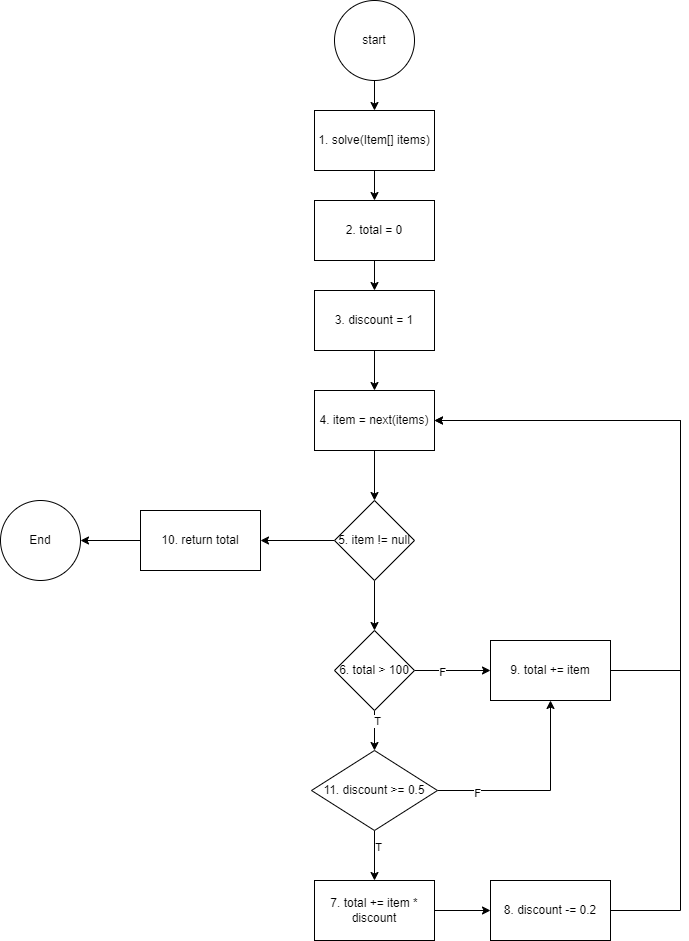

### Bảng phan tích use-def

|     Biến     |      def      |         use         |
|:------------:|:-------------:|:-------------------:|
|  **total**   | `2`, `7`, `9` | `6`, `7`, `9`, `10` |
| **discount** |   `3`, `8`    |    `11`, `7`,`8`    |
|   **item**   |      `4`      |    `5`, `7`, `9`    |

|     Biến     | du-pair |                               def-clear-path                                |                                                                     complete-path                                                                      |        testcase        | expected | actual |
|:------------:|:-------:|:---------------------------------------------------------------------------:|:------------------------------------------------------------------------------------------------------------------------------------------------------:|:----------------------:|:--------:|:------:|
|  **total**   |  2 - 7  |          2 - 3 - 4 - 5(T) - 6(F) - 9 - 4 - 5(T) -6(T) - 11(T) - 7           |                                    1 - 2 - 3 - 4 - 5(T) - 6(F) - 9 - 4 - 5(T) -6(T) - 11(T) - 7 - 8 - 4 - 5(F) - 10                                    |       [101, 200]       |   301    |  301   |
|              |  9 - 7  |                       9 - 4 - 5(T) -6(T) - 11(T) - 7                        |                                    1 - 2 - 3 - 4 - 5(T) - 6(F) - 9 - 4 - 5(T) -6(T) - 11(T) - 7 - 8 - 4 - 5(F) - 10                                    |       [101, 50]        |   151    |  151   |
|              |  7 - 9  | [7 - 8 - 4 - 5(T) - 6(T) - 11(T)] x 3 - 7 - 8 - 4 - 5(T) - 6(T) - 11(F) - 9 | 1 - 2 - 3 - 4 - 5(T) - 6(F) - 9 - 4 - 5(T) -6(T) - 11(T) - [7 - 8 - 4 - 5(T) - 6(T) - 11(T)] x 3 - 7 - 8 - 4 - 5(T) - 6(T) - 11(F) - 9 - 4 - 5(F) - 10 | [101, 50, 50, 50, 100] |   261    |  261   |
| **discount** |  3 - 8  |          3 - 4 - 5(T) - 6(F) - 9 - 4 - 5(T) -6(T) - 11(T) - 7 - 8           |                                    1 - 2 - 3 - 4 - 5(T) - 6(F) - 9 - 4 - 5(T) -6(T) - 11(T) - 7 - 8 - 4 - 5(F) - 10                                    |       [101, 100]       |   201    |  201   |
|              |  8 - 8  |                     8 - 4 - 5(T) - 6(T) - 11(T) - 7 - 8                     |                   1 - 2 - 3 - 4 - 5(T) - 6(F) - 9 - 4 - 5(T) -6(T) - 11(T) - 7 - 8 - 4 - 5(T) - 6(T) - 11(T) - 7 - 8 - 4 - 5(F) - 10                   |     [101, 50, 100]     |   231    |  231   |
|   **item**   |  4 - 9  |                             4 - 5(T) - 6(F) - 9                             |                                                    1 - 2 - 3 - 4 - 5(T) - 6(F) - 9 - 4 - 5(F) - 10                                                     |          [50]          |    50    |   50   |
